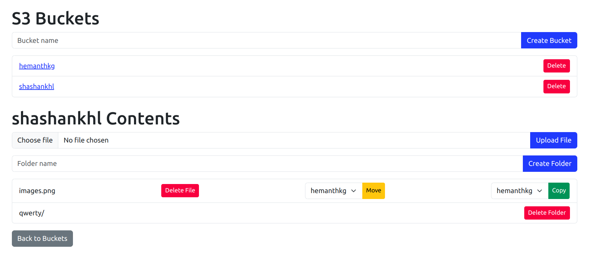

# S3 File Manager

A simple web application built with Flask that allows users to manage files and folders in Amazon S3. Users can list buckets, create/delete buckets, upload/delete files, and move/copy files between buckets.

## Features

- List all S3 buckets.
- View contents of a specific bucket.
- Create and delete buckets.
- Upload and delete files in S3 buckets.
- Create and delete folders (prefixes) in S3.
- Move and copy files between buckets.

